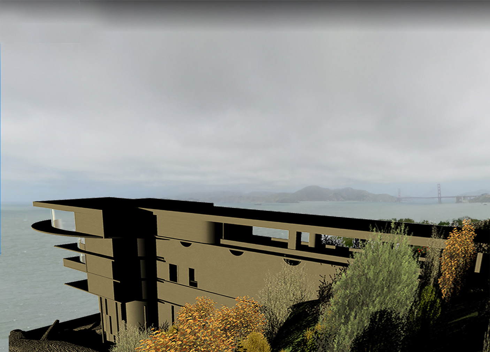
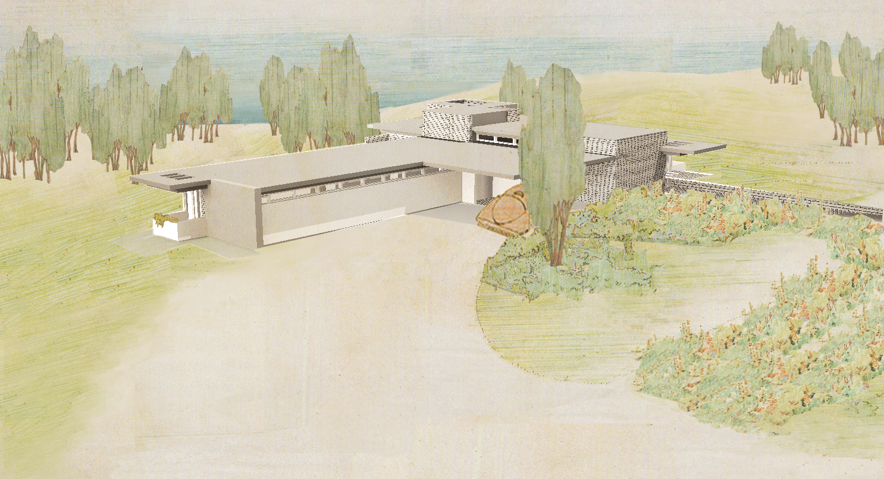
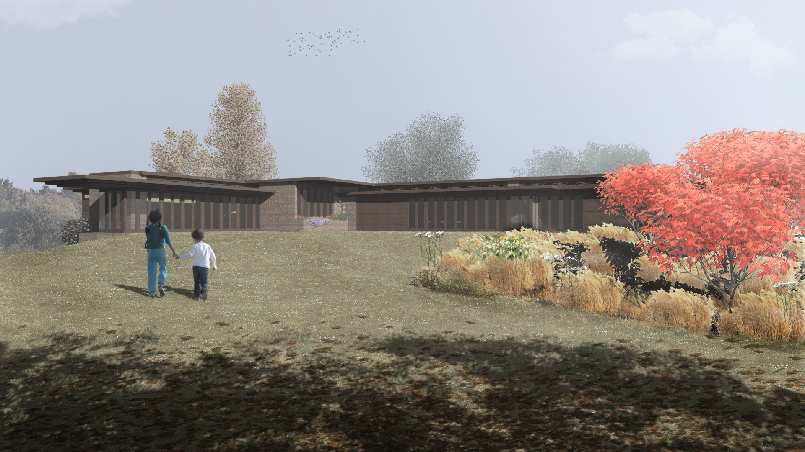

# Projects
In **groups of 3**
you will 3D model of one of
Frank Lloyd Wright's unbuilt houses or estates -
either Jester House, Usonia, Morris House, Galesburg,
Hargrove House, Kaufman Boulder House, Bailleres House,
Hennesey House, or Stillman House -
and its landscape.

Brauner House, Usonia | Morris House 1945
:-------------------------:|:-------------------------:
 | 

Newman House, Usonia   | Garrison House, Usonia
:-------------------------:|:-------------------------:
 | 

Bailleres House  | Hennessy House
:-------------------------:|:-------------------------:
 | 

Upload digital copies of your finished work to the class network drive
at `\\desn-knox.lsu.edu\Landscape-Classes` on Windows
or `smb://desn-knox.lsu.edu/Landscape-Classes` on Mac.

Please upload your *.3dm* Rhino models,
*.stl* stereolithography models,
*.png* 3D renderings,
*.psd* and *.png* photomontages,
and packaged *.indd* and *.pdf* layouts.

## 3D Renderings
Each group will create beautiful 3D renderings
of their house and its landscape.
Each rendering should have an unedited version
and a photomontaged version that
includes atmosphere, planting, and optionally people.
The plan should have
The renderings should include:
* 1 plan
* 1 sun study
* 4 section-elevations
* 4 perspectives.

## 3D Prints
Each group will make a beautiful 3D printed model
of their building and its topography.
The model should be printed in multiple parts
to reveal sectional views.
The model should be etched with metadata including
the house name, architect, date designed, location,
model scale, north arrow, 3D modeling team, and fabrication date.

## Booklet
Each group will prepare a booklet for the exhibition
about the house, the site, the clients, the original drawings,
your 3D renderings, and photos of your 3D prints.

## Exhibition
Each group will create a display for
an exhibition of the unbuilt houses.
Each display should include
a map,
plots of your 3D renderings,
your 3D prints, and
information about the house.

Find the class network drive at
`\\desn-knox.lsu.edu\Landscape-Classes` on Windows
or `smb://desn-knox.lsu.edu/Landscape-Classes` on Mac.
