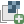
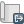

# Contents
1. [**Terrain modeling**](#terrain-modeling)
    1. [Elevation data sources](#elevation-data-sources)
    2. [3D terrain modeling](#3d-terrain-modeling)
    3. [2D terrain modeling](#2d-terrain-modeling)

# Terrain modeling
In this section you will learn how to
acquire elevation data,
re-project and process the data in GIS,
and then model the data as
3D meshes and surfaces in Rhino.

## Elevation data sources
* [National Map Viewer](http://nationalmap.gov/viewer.html)
* [US Interagency Elevation Inventory](https://coast.noaa.gov/inventory/)
* [Open Topography](http://www.opentopography.org/)


## 2D terrain modeling
In this section you will download
a digital elevation file from USGS National Maps
and import it into Arc Map to create elevation and slope maps.
_instructions for lectures on January 24 and 26 under development_

### Finding and Projecting Data
__This lesson uses data from the National Map. You can find data from other
sources, such as the links above.__

Navigate to the [National Map Viewer](https://viewer.nationalmap.gov/basic/).

![alt text][logo]

[logo]:https://github.com/baharmon/3d-modeling-course/blob/master/images/betsy-tutorials/Lecture%201/National_map_1.png "National Map"

1. Search for Baton Rouge, Louisiana and zoom to the area of study.

2. Check the `box/point` selection tool and use it to draw a box around your study  
area. The searches you will run will look for data in this area.

3. Select `Elevation Products (3DEP)` under _Data_ in your left-hand Dataset menu.

Check the boxes for [1 meter DEM and 1/9 arc-second DEM](https://nationalmap.gov/3dep_prodserv.html) and click `Find Products`.

Your data will appear in the left hand search panel. Click the `Footprint` link
next to the data see its footprint. _You can always deselect by
clicking footprint again_

Click the `download` link next to each piece of data you wish to download. For this exercise, download:

```
USGS NED ned19_n30x75_w091x25_la_statewide_2006 1/9 arc-second 2009 15x 15 minute IMG and
USGS NED ned19_n30x50_w091x00_la_statewide_2006 1/9 arc-second 2009 15x 15 minute IMG.
```

Find your zipped file folders for this data in your downloads folder.

Extract your data. Select one of your data folders, `right click > 7-zip > Extract to the folder of your choice.` _Suggested to save in your user folder. Windows C: drive > Users >
find your username._ Repeat this step for the second folder.

Delete the original zipped folders.

Start ARC CATALOG.

Click `Connect to Folder` button. Browse to your username. Create a new folder for this data.

Right click in or on new folder > New > File Geodatabase > baton_rouge.gdb


## 3D terrain modeling
In this section you will export
a digital elevation model from GRASS GIS
and import it into Rhino for 3D modeling and visualization.

### Heightfield
Start GRASS GIS in the `nc_spm_evolution` location
and select the `terrain_analysis` mapset.

Set your region to our study area with 3 meter resolution
using the module
[g.region](https://grass.osgeo.org/grass72/manuals/g.region.html)
by specifying a reference raster map.
```
g.region raster=elevation_2016 res=3
```

Round the 2016 elevation raster map
from floating point values to integers
using the raster map calculator
[r.mapcalc](https://grass.osgeo.org/grass72/manuals/r.mapcalc.html).
```
r.mapcalc expression="integer_elevation_2016 = round(elevation_2016)"
```

Export `integer_elevation_2016` to `.png` with
[r.out.gdal](https://grass.osgeo.org/grass72/manuals/r.out.gdal.html).
```
r.out.gdal input=integer_elevation_2016@terrain_analysis output=elevation_2016.png format=PNG
```

Start Rhino5.

Open the template `Large Objects - Meters.3dm`.

Create a layer called `region` and make it the current layer.

Turn on `Grid Snap` and `Ortho`.
Create a 450m x 450m rectangle the size of our study landscape
with the corner-to-corner
[Rectangle](http://docs.mcneel.com/rhino/5/help/en-us/commands/rectangle.htm)
command.
```
_Rectangle
First corner of rectangle: 0,0
Other corner or length: 450,450
```

Create a layer called `surface` and make it the current layer.

Run the command [Heightfield from Image](http://docs.mcneel.com/rhino/5/help/en-us/commands/heightfield.htm).
Open bitmap `elevation.png`.
Use the 450m x 450m rectangle to define
the first and second corners of the heightfield.
Set `Number of sample points: 30 x 30`,
set `Height: 113 meters`,
check `Set image as texture`,
and select `Create object by: Surface from control points at sample locations`.
```
_Heightfield
First Corner: 0,0
Second corner or length: 450
```

Create contours with the [Contour](http://docs.mcneel.com/rhino/5/help/en-us/commands/contour.htm) command.
```
_Contour
Select objects for contours
_Enter
Contour plane base point: 0,0,0
Direction perpendicular to contour planes: 0,0,1
Distance between contours: 1.00
_Enter
```

Save as `heightfield.3dm`.
```
_SaveAs
```

### Heightfield mesh
In Rhino 5 open `heightfield.3dm`

Turn off the `surface` layer.
Create a layer called `mesh`
and make it the current layer.

Run the command [Heightfield from Image](http://docs.mcneel.com/rhino/5/help/en-us/commands/heightfield.htm).
Open bitmap `elevation.png`.
Use the 450m x 450m rectangle to define
the first and second corners of the heightfield.
Set `Number of sample points: 150 x 150`,
set `Height: 113 meters`,
check `Set image as texture`,
and select `Create object by: Mesh with vertices at sample locations`.
```
_Heightfield
First Corner: 0,0
Second corner or length: 450
```

Save `heightfield.3dm`.
```
_Save
```

### Point cloud patching
Start GRASS GIS in the `nc_spm_evolution` location
and select the `terrain_analysis` mapset.

Set your region to our study area with 3 meter resolution
using the module
[g.region](https://grass.osgeo.org/grass72/manuals/g.region.html)
by specifying a reference raster map.
Export `elevation_2016` as a comma delimited xyz point cloud.
```
g.region raster=elevation_2016 res=3
r.out.xyz input=elevation_2016 output=D:\rhino\elevation_3m.xyz separator=comma
```

Start Rhino5.

Open the template `Large Objects - Meters.3dm`.

Create a layer called `point_cloud` and make it the current layer.

Import the comma-delimited 3m resolution xyz point cloud.
For `Delimiters` select comma. Check `Create point cloud`.
Then zoom all viewports to the extent of the data.
```
_Import
Zoom
All
Extents
```

Use the
[Scale1D](http://docs.mcneel.com/rhino/5/help/en-us/commands/scale1d.htm)
command to vertically exaggerate your elevation data by a factor of 3.
```
Scale1D
Origin point: 0,0,0
Scale factor: 3
Scale direction: 0,0,1
```

Create a layer called `plane` and make it the current layer.

Create a corner to corner rectangular plane
with the [Plane](http://docs.mcneel.com/rhino/5/help/en-us/commands/plane.htm)
command.
Designate opposite corners of the point cloud.
Then use the Gumball to move the plane beneath the lowest point.
```
_Plane
```

Create a layer called `surface` and make it the current layer.

Use the [Patch](http://docs.mcneel.com/rhino/5/help/en-us/commands/patch.htm)
command to create a NURBS surface.
Set `Sample point spacing` to `1.0`,
set `Surface U spans` to `150`,
set `Surface V spans` to `150`,
and set the `Starting surface` to the plane.
```
Patch
```

Hide or delete the point cloud layer.

Set all viewports to `Rendered` mode.

Make the plane larger with the
[Scale2D](http://docs.mcneel.com/rhino/5/help/en-us/commands/scale2d.htm)
command
```
Command: Scale2D
Origin point
Scale factor: 1.25
```

Create a layer called `solid` and make it the current layer.

Use the
[Extrude surface to boundary](http://docs.mcneel.com/rhino/5/help/en-us/commands/extrudesrf.htm)
command to extrude the topographic NURBS surface to the plane
to create a solid model with a base.
Select the plane as the boundary surface.
```
_ExtrudeSrf
_Solid=_Yes
_ToBoundary
Select a boundary surface
```

Hide or delete the plane layer.

Save as `nc_spm_evolution_3m.3dm`.
```
_SaveAs
```

### Material and texture mapping
Start GRASS GIS in the `nc_spm_evolution` location
and select the `PERMANENT` mapset.


Add the raster map layer `naip_2014` with the latest orthophoto
to your map display. Resize your map display so that is square and
zoom to the selected map.
Export this map with the
`Save display to graphic file`

button. Save as `naip_2014.png`.


Start Rhino5 and open `nc_spm_evolution_3m.3dm`.

Select the polysurface model of the topography.
In the `properties` tab click the `material` button.
Set `Assign material by:` to `Object`.
In the `Textures` section
set `Color` to the file `naip_2014.png`
Click the `Texture mapping` button and
set `Type` to `Planar (UVW)`.
Optionally turn on the sun with the command `sun`.
```
_SaveAs
```

### RhinoTerrain

Start GRASS GIS in the `nc_spm_evolution` location
and select the `terrain_analysis` mapset.

Set your region to our study area with 1 meter resolution
using the module
[g.region](https://grass.osgeo.org/grass72/manuals/g.region.html)
by specifying a reference raster map.
Export `elevation_2016` as a georeferenced tif image (GeoTIFF).
```
g.region raster=elevation_2016 res=1
r.out.gdal input=elevation_2016 output=elevation_2016.tif format=GTiff
```

Start Rhino5.

Open the template `Large Objects - Meters.3dm`.

Create a layer called `point_cloud` and make it the current layer.

Use the RhinoTerrain plugin to import
the elevation geotif raster as a point cloud.
Alternatively you could import an xyz point cloud or a .las file.
Run the RhinoTerrain command `Import elevation raster file`,
select `elevation_2016.tif`,
for `Choose target coordinate system` select `Use input data coordinate system`,
for `Output type` select `Point cloud`.
```
RtImportElevation
```

Use the
[Scale1D](http://docs.mcneel.com/rhino/5/help/en-us/commands/scale1d.htm)
command to vertically exaggerate your elevation data by a factor of 3.
```
Scale1D
Origin point: 0,0,0
Scale factor: 3
Scale direction: 0,0,1
```

Create a layer called `mesh` and make it the current layer.

Create a triangulated mesh using the RhinoTerrain command `Create Terrain Mesh`.
Select the point cloud when prompted `Select objects for triangulation`.
Accept the previewed result.
```
RtMeshTerrainCreate
_Accept
```

Turn off or delete the `point_cloud` layer.
Set viewports to `Rendered` mode.

Create a 50m base for the terrain model
using the RhinoTerrain command `Create Terrain Base`
```
RtMeshTerrainBase
Select mesh (BaseHeightStyle=Relative  BaseHeight=50)
_Enter
```

Optionally use the RhinoTerrain `Create contour curves` command
to compute contours.  
```
RtCartographyContoursCurvesCreate
Select mesh
_Enter
Select mesh (FirstInterval=1  SecondInterval=10  ThirdInterval=0  FourthInterval=0  ContourSmoothness=0  Complete)
_Complete
```

Turn on the `Sun`,
set `Date and time` to `Now`,
and set `Location` to `Here`.
```
Sun
```

Save as `rhinoterrain.3dm`
```
_SaveAs
```
